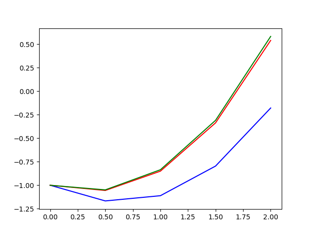
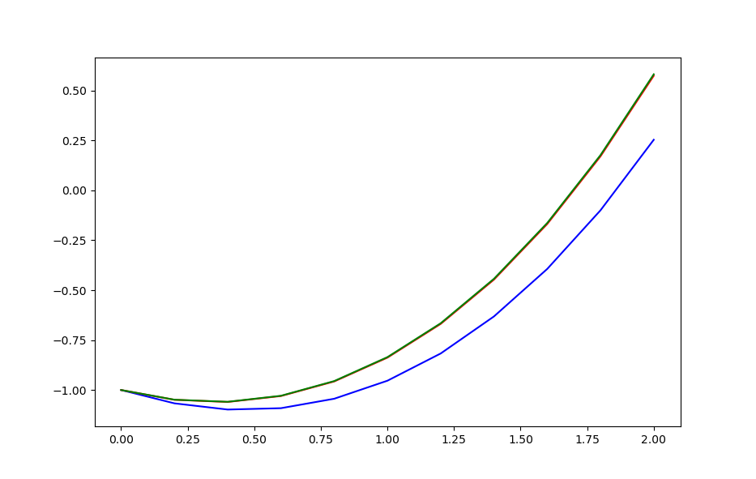

# **Proyecto de EDO.Facultad de Matemática y Computación. Universidad de La Habana. Curso 2022.**

**Nombres:**
     Francisco Vicente Suárez Bellón C212
     Maria de Lourdes Choy           C212
     Carla Sunami Pérez Valera       C212
     Lázaro David Alba Ajete         C211

* Navegación:
- [**Proyecto de EDO.Facultad de Matemática y Computación. Universidad de La Habana. Curso 2021.**](#proyecto-de-edofacultad-de-matemática-y-computación-universidad-de-la-habana-curso-2021)
  - [Nombres:](#nombres)
- [Problema 1 y 2](#problema-1-y-2)
  - [Solución al problema de valor inicial usando el método numérico de Euler](#solución-al-problema-de-valor-inicial-usando-el-método-numérico-de-euler)
  - [Solución al problema de valor inicial usando el método numérico de Runge Kutta](#solución-al-problema-de-valor-inicial-usando-el-método-numérico-de-runge-kutta)
- [Representación de la solución al a ecuación  usando los 3 métodos numéricos](#representación-de-la-solución-al-a-ecuación--usando-los-3-métodos-numéricos)
  - [With h = 0.5](#with-h--05)
  - [With h = 0.2](#with-h--02)
- [Problema 3](#problema-3)
  - [Método de Runge Kutta](#método-de-runge-kutta)
  - [Representación de la solución](#representación-de-la-solución)

```py
import numpy as np
import matplotlib.pyplot as plt
import math

f =  lambda x,y : x+y**1/3
f2 = lambda t,v : -0.04*v - 9.8
Solutionf2 = lambda  t: (294*math.e**(-t/25)) - 245

def Method_euler(Xn,Yn,h,f):
    yn1 = Yn + (h * f(Xn,Yn))
    return yn1

def Method_eulerMejorado(Xn,Yn,h,f):
      k1 = f(Xn,Yn)
      un1 = Yn + (h * k1)
      k2 = f(Xn+h,un1)
      yn1 = Yn + (h * (1/2)*(k1 + k2))
      return yn1

def Runge_Kutta(Xn,Yn,h,f):
     k1 = f(Xn,Yn)
     k2 = f( Xn +(1/2)*h,Yn+(1/2)*h*k1)
     k3 = f(Xn +(1/2)*h,Yn+(1/2)*h*k2)
     k4 = f(Xn+h,Yn+ h*k3)
     Yn1 = Yn + (h/6 *(k1 + 2*k2 + 2*k3 + k4))
     return Yn1

def Numeric_Methods(X0,Y0,h,f,method,end,rnd):
     X = np.arange(X0,end+h,h)
     Y = [Y0]
     for i in range(len(X)-1):
          Y.append(round(method(X[i],Y[i],h,f),rnd))
     return X,Y

def splitInterval(lis1,lis2,n):
     hx = int(len(lis1)/n)
     X =[]
     Y =[]
     for i in np.arange(0,len(lis1),hx):
          X.append(round(lis1[i],2))
          Y.append(lis2[i])
     return X,Y

def printer(list):
     for i in range(len(list)):
          print('\n')
          print(list[i])
     print("--------------------------------------")
     print("--------------------------------------")

def EvalSolution(X0,h,f,end):
     X = np.arange(X0,end+h,h)
     Y = []
     for i in range(len(X)):
          Y.append(round(f(X[i]),2))
     return X,Y

     
#Descomentar esto para ver las soluciones y el ploteo
#-----------------------------------------------------------
# print("Solución 1")
#-----------------------------------------------------------
# he1 = Numeric_Methods(0,-1,0.1,f,Method_euler,2,4)
# he2 = Numeric_Methods(0,-1,0.02,f,Method_euler,2,4)
# he3 = Numeric_Methods(0,-1,0.004,f,Method_euler,2,4)
# he4 = Numeric_Methods(0,-1,0.0008,f,Method_euler,2,4)
# e1 = splitInterval(he1[0],he1[1],10)
# e2 = splitInterval(he2[0],he2[1],10)
# e3 = splitInterval(he3[0],he3[1],10)
# e4 = splitInterval(he4[0],he4[1],10)
# print(e1)
# printer(e1[1])
# printer(e2[1])
# printer(e3[1])
# printer(e4[1])
# #------------------------------------------------------------
# print("Solución 2")
# #------------------------------------------------------------
# hr1 = Numeric_Methods(0,-1,0.2,f,  Runge_Kutta,2,6)
# hr2 = Numeric_Methods(0,-1,0.1,f,  Runge_Kutta,2,6)
# hr3 = Numeric_Methods(0,-1,0.05,f, Runge_Kutta,2,6)
# hr4 = Numeric_Methods(0,-1,0.025,f,Runge_Kutta,2,6)

# r1 = splitInterval(hr1[0],hr1[1],5)
# r2 = splitInterval(hr2[0],hr2[1],5)
# r3 = splitInterval(hr3[0],hr3[1],5)
# r4 = splitInterval(hr4[0],hr4[1],5)
# print(r1)
# printer(r1[1])
# printer(r2[1])
# printer(r3[1])
# printer(r4[1]) 
#------------------------------------------------------------
# Representación de los 3 métodos con distintos pasos
#------------------------------------------------------------
#e1 = Numeric_Methods(0,-1,0.5,f,Method_euler,2)
#m1 = Numeric_Methods(0,-1,0.5,f,Method_eulerMejorado,2)
#r1 = Numeric_Methods(0,-1,0.5,f,Runge_Kutta,2)
#e2 = Numeric_Methods(0,-1,0.2,f,Method_euler,2)
#m2 = Numeric_Methods(0,-1,0.2,f,Method_eulerMejorado,2)
#r2 = Numeric_Methods(0,-1,0.2,f,Runge_Kutta,2)
#
#plt.plot(e1[0],e1[1],"b")
#plt.plot(m1[0],m1[1],"r")
#plt.plot(r1[0],r1[1],"g")
#plt.show()
#plt.plot(e2[0],e2[1],"b")
#plt.plot(m2[0],m2[1],"r")
#plt.plot(r2[0],r2[1],"g")

#------------------------------------------------------------
# print("Solución 3")
# ------------------------------------------------------------
# rk1 = Numeric_Methods(0,49,0.2,f2,Method_eulerMejorado,10,2)
# rk2 = Numeric_Methods(0,49,0.1,f2,Method_eulerMejorado,10,2)
# rks = EvalSolution(0,0.1,Solutionf2,10)
 
# plt.plot(rk1[0],rk1[1],"b")
# plt.plot(rk2[0],rk2[1],"r")
# plt.plot(rks[0],rks[1],"g")
# plt.show()
# s1 = splitInterval(rk1[0],rk1[1],10)
# s2 = splitInterval(rk2[0],rk2[1],10)
# s3 = splitInterval(rks[0],rks[1],10)
 
# print(s1)
# printer(s1[1])
# printer(s2[1])
# printer(s3[1])
# ------------------------------------------------------------
```
# Problema 1 y 2
$y'=x+\sqrt[3]{y}\quad\ y(0) = -1\quad\  0\leq\ x \leq 2$

## Solución al problema de valor inicial usando el método numérico de Euler


| x |with h = 0.1 |with h = 0.02|with h = 0.004|with h = 0.0008|
|---|-------------|-------------|--------------|---------------|
|0.0|-1           |-1           |-1            |-1             |  
|0.2|-1.0577      |-1.0505      |-1.0487       |-1.0481        |
|0.4|-1.0788      |-1.0632      |-1.0596       |-1.0595        |
|0.6|-1.0606      |-1.0355      |-1.0298       |-1.0285        | 
|0.8|-1.0005      |-0.9646      |-0.9567       |-0.9552        |
|1.0|-0.8956      |-0.8476      |-0.8373       |-0.8356        |
|1.2|-0.743       |-0.6815      |-0.6684       |-0.6661        |
|1.4|-0.5394      |-0.4626      |-0.4464       |-0.4434        |
|1.6|-0.2813      |-0.1874      |-0.1677       |-0.1649        |
|1.8|0.0349       |0.1479       |0.1712        |0.1755         |
|2.0|0.4133       |0.5474       |0.575         |0.5793         |

## Solución al problema de valor inicial usando el método numérico de Runge Kutta

| x | with h = 0.2|with h = 0.1|with h = 0.05|with h = 0.025|
|---|-------------|------------|-------------|--------------|    
|0.0|-1           |-1          |-1           |-1            |
|0.4|-1.058953    |-1.058953   |-1.058953    |-1.058955     |
|0.8|-0.955158    |-0.955157   |-0.955159    |-0.955161     |      
|1.2|-0.665402    |-0.6654     |-0.665402    |-0.665404     |
|1.6|-0.163161    |-0.163158   |-0.16316     |-0.16316      |
|2.0|0.581872     |0.581875    |0.581873     |0.581872      |


# Representación de la solución al a ecuación  usando los 3 métodos numéricos

> Nota:
* blue : Euler
* red : Euler Mejorado
* green: Runge Kutta

## With h = 0.5

## With h = 0.2


# Problema 3

$ \dfrac{dv}{dx} = -0.04\cdot v -9.8 \quad\ v(0)=49 $ 
***Solución:***
$v(t) =  294\cdot\ e^\frac{-t}{25} -245$
## Solución al problema de valor inicial usando el método numérico de Euler mejorado
| t  | with h = 0.2|with h = 0.1|Y exacta|
|----|-------------|-----------|--------|
|0.0 |49           |49         |49.0    |
|1.0 |37.47        |37.47      |37.47   |
|2.0 |26.39        |26.39      |26.4    |
|3.0 |15.75        |15.75      |15.75   |
|4.0 |5.53         |5.53       |5.53    |
|5.0 |-4.29        |-4.29      |-4.29   |
|6.0 |-13.73       |-13.73     |-13.73  |  
|7.0 |-22.79       |-22.79     |-22.8   |  
|8.0 |-31.5        |-31.51     |-31.51  |  
|9.0 |-39.87       |-39.89     |-39.88  |  
|10.0|-47.91       |-47.94     |-47.93  |  


* Podemos ver en la tabla que las soluciones concuerdan y cuando h es mas pequeña mas se acercan a la real
## Representación de la solución


* a) Alcanza el máximo de en el intervalo de 4.5 a 4.6 segundos
* b) Alcanza -43.15 m/s aproximadamente